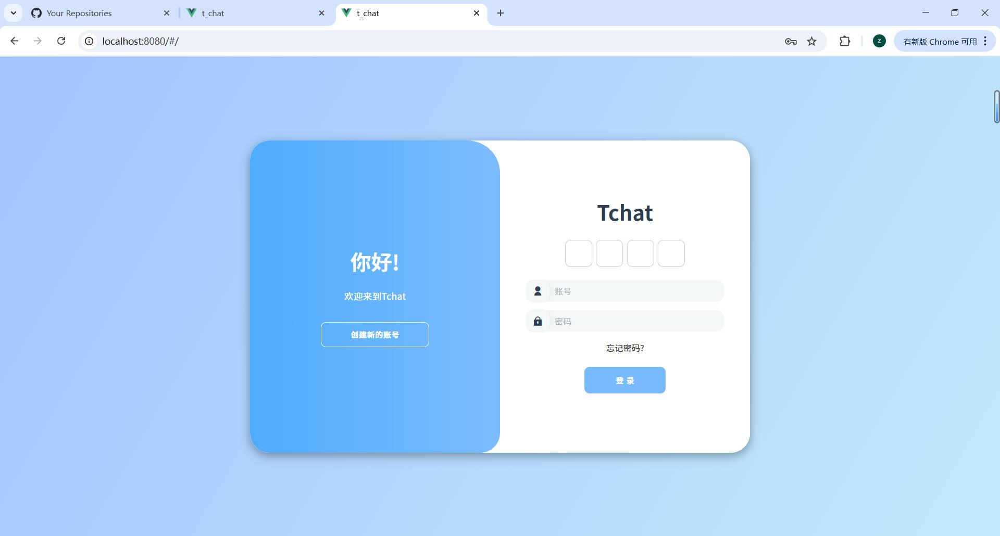
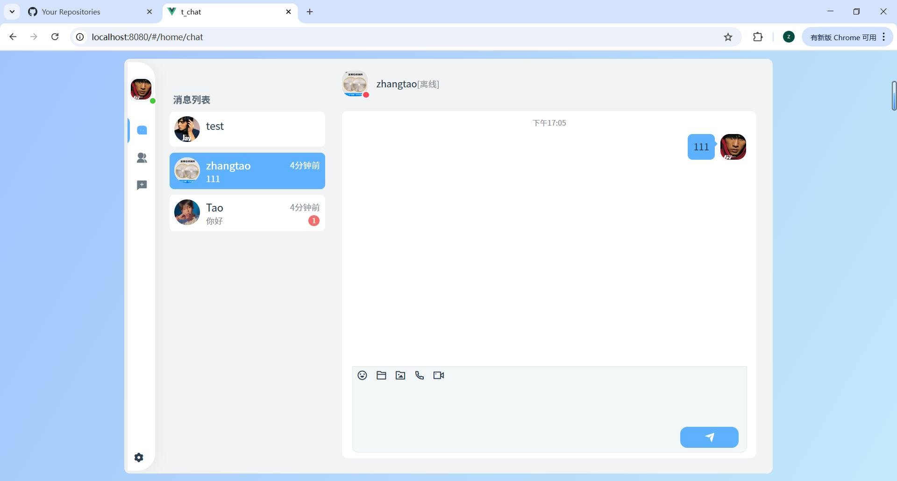
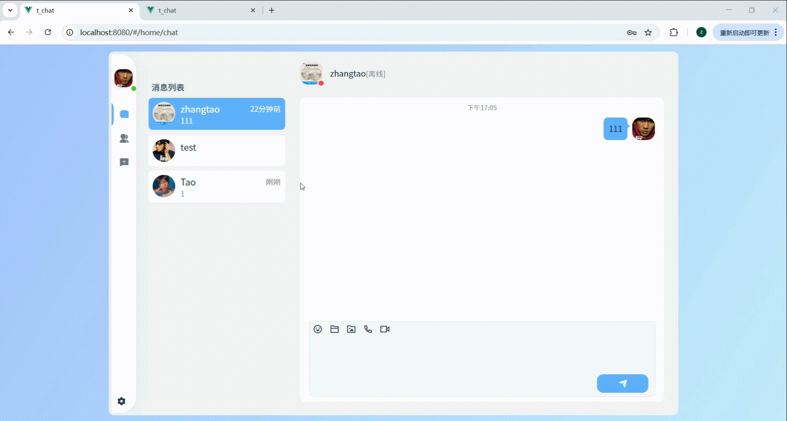

## t_chat
 
 `t_chat`是一个基于 Webman 的 PHP 聊天项目，前端采用 Vue。

## 项目预览

## 结构
 - `app/`后端控制器、模型和中间件
 - `common/`共享的帮助程序和实用程序
 - `config/Webman` 和应用程序配置
 - `front/Vue 2` 前端
 - `public/`静态资源和上传的媒体
 - `runtime/`运行时文件和日志
  
## 技术栈

 - PHP/Webman
 - Vue 2
 - 元素 UI
 - Axios

## Notes

 - 使用 Composer 安装后端依赖项。
 - front/使用npm 或 pnpm安装前端依赖项。
 - 复制.env.example到.env本地数据库并更新 Redis 设置。
 - 运行时日志会node_modules被版本控制系统忽略。
